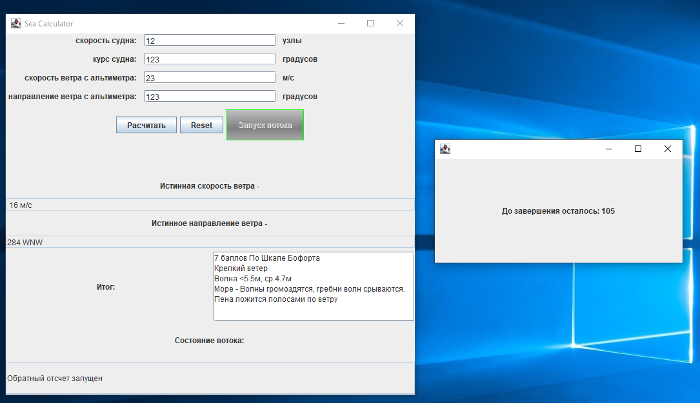

# Приложение для расчета силы и направления ветра в зависимости от показаний альтиметра, курса и скорости судна. Демо-функция условной работы в отдельном потоке.

## Примененный стек технологий: Java Swing

